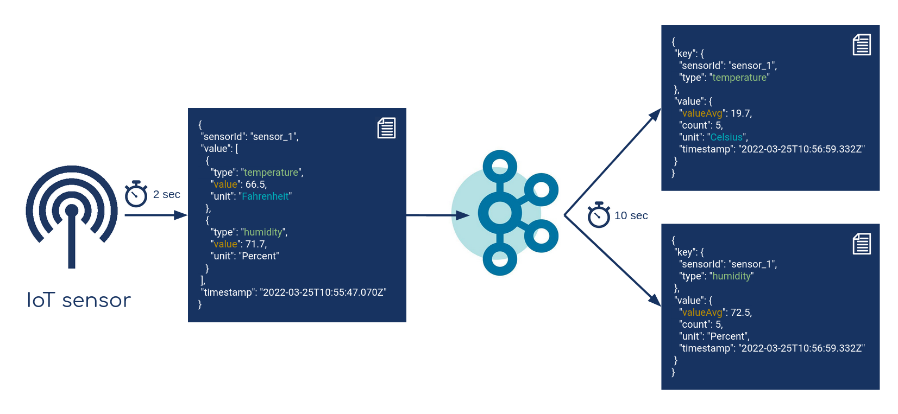

# Stream Processing Playground

This repository showcases different approaches to stream processing, focusing on **data transformation**, **wrangling**, and **aggregation**. 
using the following tools:
- [Kafka Streams (KStreams)](https://kafka.apache.org/documentation/streams/)
- [ksqlDB](https://ksqldb.io/)
- [Confluent FlinkSQL](https://docs.confluent.io/cloud/current/flink/index.html)
- [Streamiz](https://github.com/LGouellec/streamiz)




## Run on Confluent Cloud

We run the stream processing pipeline on Confluent Cloud (CC).

To get started, you'll need to provide the necessary configurations (like bootstrap server, API keys, etc.) in your applications. Once that's set up, you can launch the Kafka Producer and Kafka Streams by running 
```
./gradlew run
```